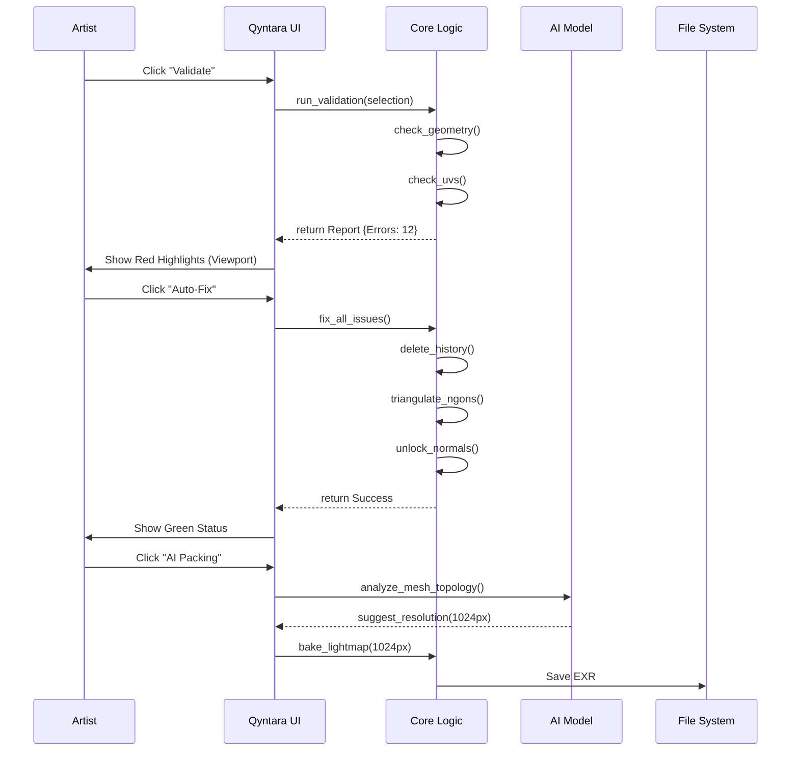

# Qyntara AI: Next-Gen 3D Asset Assurance & Optimization
## Technical Architecture & Workflow Overview
**Date:** December 2025
**Version:** 2.0 (feature-complete)

---

## 1. Executive Summary

Qyntara AI is a comprehensive **Asset Assurance Pipeline** for modern 3D production. It bridges the gap between artistic creation and engine requirements by providing real-time validation, automated repair, and standardized optimization tools directly within Autodesk Maya.

**Core Value Proposition:**
*   **Assurance:** "Green Check" confidence before files leave the artist's workstation.
*   **Speed:** Automated cleanup of topology errors (N-gons, History) saves hours of manual labor.
*   **Standardization:** Enforces uniform UV density, lightmap packing, and naming conventions.
*   **Intelligence:** Uses Deep Learning to detect subjective geometric anomalies that rule-based checkers miss.

---

## 2. High-Level System Architecture

The following diagram illustrates the modular design of the Qyntara Client, showing how the Core Logic separates "Validation" from "Creation" (Baking/UVs).

```mermaid
graph TD
    %% Classes
    classDef ui fill:#262626,stroke:#00CEC9,color:white,stroke-width:2px;
    classDef core fill:#1e1e1e,stroke:#74b9ff,color:white,stroke-width:2px;
    classDef ext fill:#333,stroke:#aaa,stroke-width:1px,color:#aaa;

    User([3D Artist]) -->|Interacts| UI[Qyntara UI Layer]
    
    subgraph "Qyntara Client (Maya Plugin)"
        UI -->|Tab: Validation| Validator[Validator Engine]
        UI -->|Tab: Auto-Fix| Fixer[Auto-Fix Module]
        UI -->|Tab: UV Tools| UVEng[UV Engine]
        UI -->|Tab: Baking| BakeEng[Baking Engine]
        UI -->|Tab: Export| ExpEng[Safe Exporter]
        
        Validator -->|Reads| MayaScene[(Maya Scene DAG)]
        Fixer -->|Modifies| MayaScene
        
        subgraph "Intelligence Layer"
            Validator -.->|Calls| Rules[Rule Definitions]
            Fixer -.->|Calls| AI_Inf[AI Inference (MeshAnomalyNet)]
        end
        
        BakeEng -->|Controls| Arnold[Arnold Renderer]
        ExpEng -->|Sanitizes & Writes| FBX[FBX File]
    end

    class UI ui;
    class Validator,Fixer,UVEng,BakeEng,ExpEng core;
    class MayaScene,Arnold,FBX ext;
```

---

## 3. Module Breakdown

### 3.1. Validation & Auto-Fix Core
The heart of the system.
*   **Validator**: Iterates through 40+ atomic rules (Geometry, Transform, Naming).
*   **Auto-Fixer**: A deterministic state machine that resolves errors. It uses a "Sanitize First" approach (e.g., Delete History -> Freeze Transforms -> Fix Geometry).

### 3.2. Advanced Baking Engine ("The Virtual Studio")
A novel module designed to democratize lookdev.
*   **Studio Rig**: Procedurally generates a 3-point lighting setup (Key, Fill, Rim) suited to the object's bounding box.
*   **OptiX Integration**: Leverages GPU denoising for near-instant lightmap baking.
*   **Resolution AI**: Calculates optimal texture resolution based on World-Space Surface Area to maintain consistent Texel Density (e.g., 10.24 px/cm).

### 3.3. Deep Learning Integration
Qyntara uses a hybrid approach:
*   **Heuristic Rules**: For objective errors (N-gons, Zero Area Faces). 100% accuracy.
*   **MeshAnomalyNet (PointNet)**: For subjective errors. It samples the mesh surface into a point cloud and detects "awkward" topology flow or pinching that passes mathematical checks but looks bad in-engine.

---

## 4. Detailed Component Data Flow



---

## 5. Technology Stack

*   **Frontend**: PySide2 (Qt for Python). Styled with CSS/QSS for a "Dark Modern" aesthetic.
*   **Core**: Python 3.7+ (Maya Embedded).
*   **3D API**: Maya OpenMaya (API 2.0) for high-performance mesh traversal.
*   **Renderer**: Arnold API (mtoa) for lightmap generation.
*   **AI**: PyTorch (External process) or ONNX Runtime for inference.

---

## 6. Deployment & Future

*   **Current**: Single-file install (module based).
*   **Q3 2026**: "Headless" version for Jenkins CI/CD pipelines (rejecting bad commits automatically).

